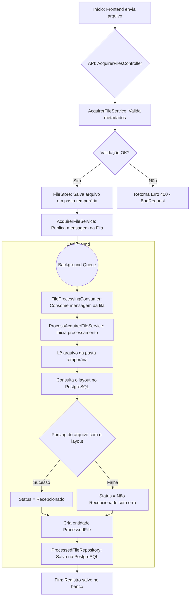

# Processador de Arquivos

## Tecnologias Utilizadas

- **Backend:**
  - .NET 9
  - ASP.NET Core API
  - Entity Framework Core
- **Frontend:**
  - Angular 20+
  - TypeScript
  - SCSS
- **Banco de Dados & Infraestrutura:**
  - PostgreSQL
  - Docker & Docker Compose

## Pré-requisitos

Para rodar este projeto, você precisa ter instalado na sua máquina:

- [Docker](https://www.docker.com/products/docker-desktop/)
- [Git](https://git-scm.com/) (para clonar o repositório)

Nenhuma outra dependência (.NET SDK, Node.js, Angular CLI, etc.) é necessária, pois todo o ambiente de compilação e execução é gerenciado pelo Docker.

## Como Rodar o Projeto

Siga os passos abaixo para subir a aplicação completa (Backend, Frontend e Banco de Dados) com um único comando.

**1. Clone o Repositório**
Abra um terminal e clone o projeto para a sua máquina local:

```bash
git clone https://github.com/LhuizF/file-processor-case
```

**2. Navegue até a Pasta do Projeto**

```bash
cd file-processor-case
```

**3. Inicie a Aplicação com Docker Compose**
Execute o seguinte comando. Na primeira vez, ele irá baixar as imagens necessárias, construir as imagens do backend e frontend, e iniciar os contêineres. Isso pode levar alguns minutos.

```bash
docker-compose up --build
```

- A flag `--build` força a reconstrução das imagens, garantindo que as últimas alterações do seu código sejam utilizadas.

**4. Parando a Aplicação**
Para parar todos os serviços, pressione `Ctrl + C` no terminal onde o compose está rodando, ou execute o seguinte comando na pasta do projeto:

```bash
docker-compose down
```

## Acessando a Aplicação

Depois que os contêineres estiverem rodando, os serviços estarão disponíveis nos seguintes endereços:

- **Portal Web (Frontend):** [http://localhost:4200](http://localhost:4200)

  - Esta é a interface principal para upload e visualização dos arquivos processados.

- **API (Backend - Documentação Swagger):** [http://localhost:8080/swagger](http://localhost:8080/swagger)

  - Interface para visualizar e testar os endpoints da API diretamente.

Para fazer o processamento de arquivos, clique em Enviar Arquivo e selecione um arquivo .txt do seu computador. Na pasta arquivos, localizada na raiz do projeto, há exemplos que podem ser enviados.

### Fluxo principal para processamento de arquivos.


